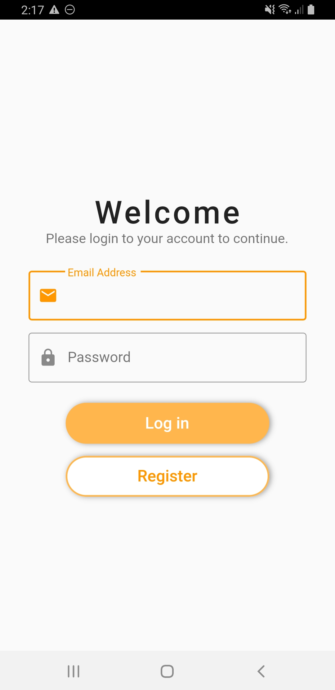
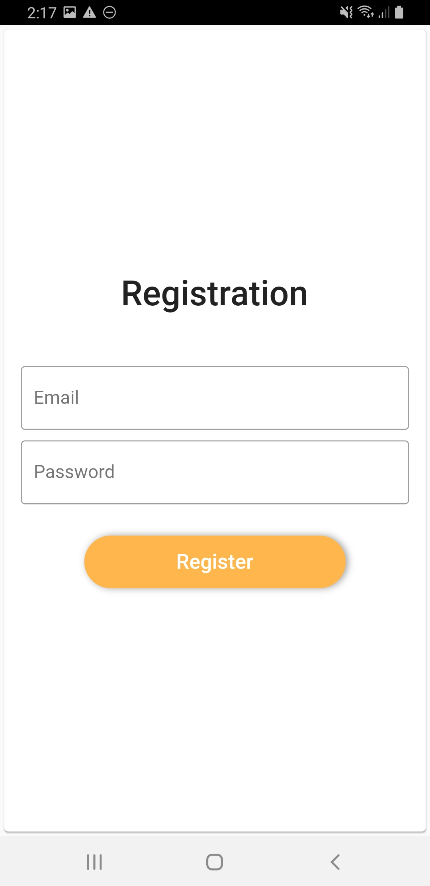
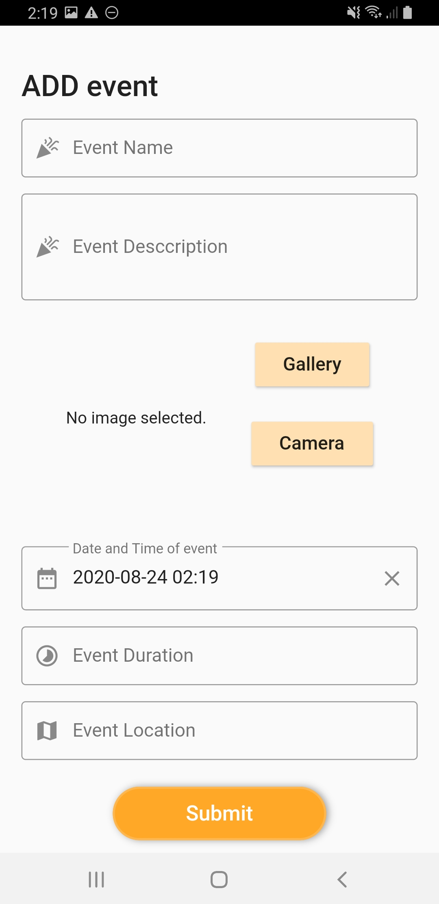
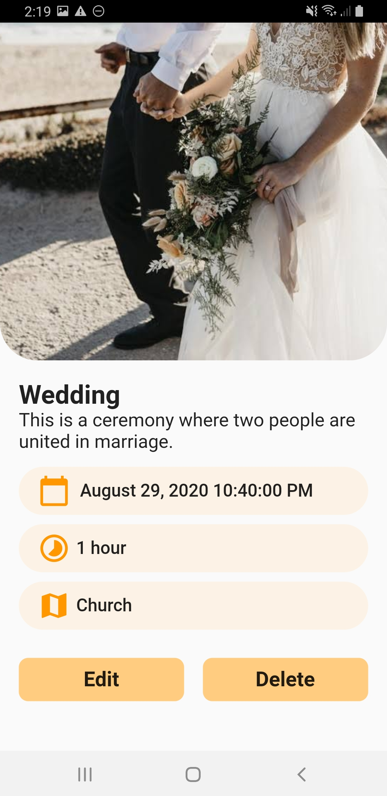
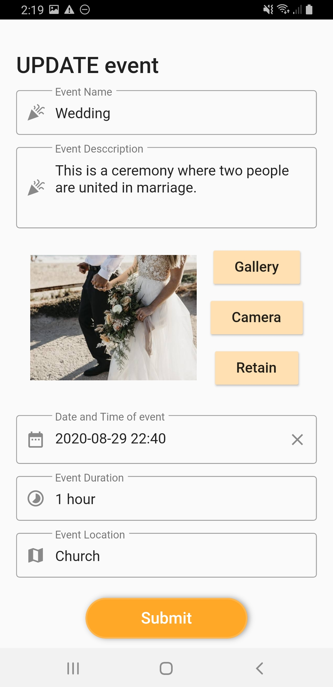
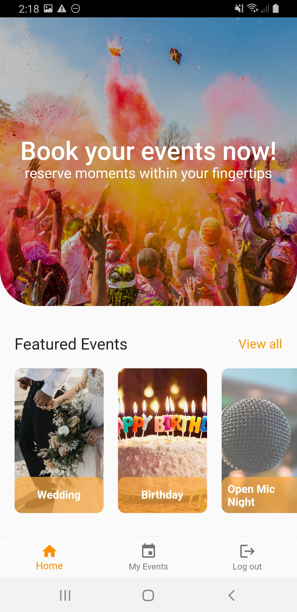
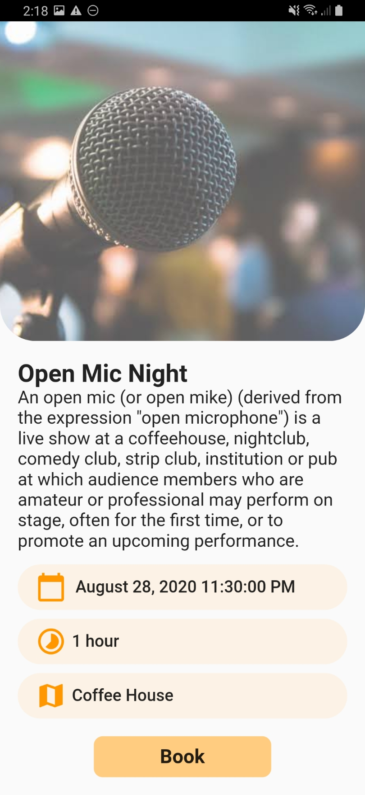
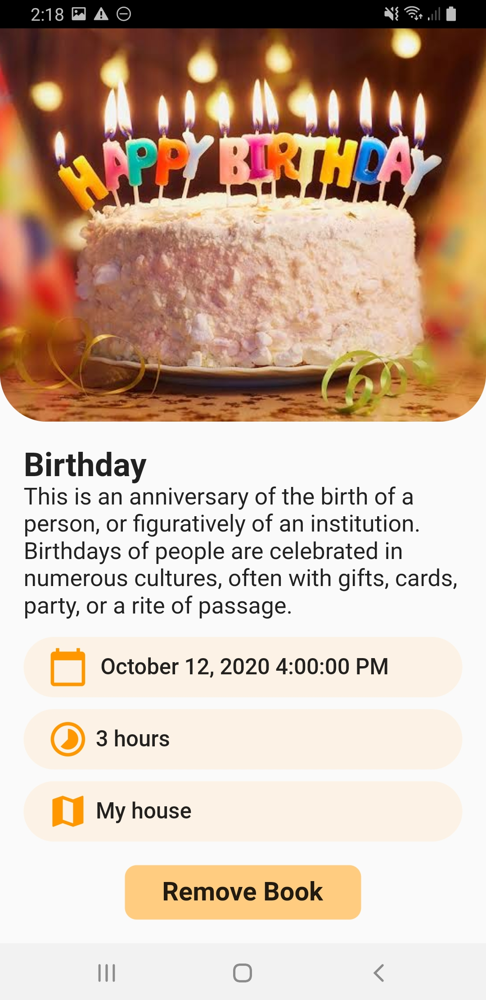

<p align="center">
 
  <h1 align="center">Event Booking App</h1>

  <p align="center">
    A simple event booking Flutter app
    <br />
    <a href="https://github.com/mfosato/event_booking"><strong>Explore the docs »</strong></a>
    <br />
    <br />

  </p>
</p>


<!-- TABLE OF CONTENTS -->
## Table of Contents

  * [Built With](#built-with)
* [Getting Started](#getting-started)
  * [Prerequisites](#prerequisites)
  * [Installation](#installation)
* [Usage](#usage)
  * Login and Registration
  * Administrator User
  * Customer User
* [Contributing](#contributing)
* [Contact](#contact)


### Built With
This section should list any major frameworks that you built your project using. Leave any add-ons/plugins for the acknowledgements section. Here are a few examples.
* [Flutter](https://flutter.dev)
* [Firebase Authentication](https://firebase.google.com/docs/auth)
* [Firebase Storage](https://firebase.google.com/docs/storage)
* [Firebase Cloud Firestore](https://firebase.google.com/docs/firestore)


<!-- GETTING STARTED -->
## Getting Started

This is how you set up your project locally.
To get a local copy up and running follow these simple example steps.

### Prerequisites

Make sure your Flutter environment is setup through this guide.

* [Flutter Installation Guide](https://flutter.dev/docs/get-started/install?gclsrc=aw.ds&&gclid=Cj0KCQjwp4j6BRCRARIsAGq4yMFtSnYoM9uwtjuJ8bqrrXL8O3OkInURK9uLmB-dU9xrAELdvUGUdu8aAmnpEALw_wcB)


### Installation


1. Clone the repo
```sh
git clone https://github.com/mfosato/event_booking
```
2. Install publication packages
```sh
flutter pub get
```
3. Run the project
```sh
flutter run -d *insert name of device*
```


<!-- USAGE EXAMPLES -->
## Usage

This is how to use the application.

### Log in and Registration

The application has two types of users: Administrator and Customers. 

The administration logs in using the following credentials while the customers use their preferred email and password.

<b>Email:</b> admin <b> Password:</b> admin

 
The customers can register using an email and password. The registration and log in of users are authenticated using the Google Platform Firebase Authentication.
 

#### Administrator User

An admin user can <b>view</b>, <b>add</b>, <b>update</b>, and <b>delete</b> the following parameters for an event:
- event name
- event description
- event photo
- date and time of the event
- event duration
- event location

##### View, Update and Delete Event
<p float="left">
 
 
</p>

##### Add and Update Event
 <p float="left">
 
 
</p>
 
 ##### View and Replace Featured Image
 An admin user can also view and replace featured image.
 

 
 
 
 #### Customer User

A customer user can view all events. They can also book and delete booked event.

##### View All Events
 

##### View, Add, and Delete Booked Event
<p float="left">
 
 
</p>


<!-- CONTRIBUTING -->
## Contributing

Contributions are what make the open source community such an amazing place to be learn, inspire, and create. Any contributions you make are **greatly appreciated**.

1. Fork the Project
2. Create your Feature Branch (`git checkout -b feature/AmazingFeature`)
3. Commit your Changes (`git commit -m 'Add some AmazingFeature'`)
4. Push to the Branch (`git push origin feature/AmazingFeature`)
5. Open a Pull Request


<!-- CONTACT -->
## Contact

Marybeth Flonia Sato

* [Email](mailto:floniasato@gmail.com)
* [Facebook](http://facebook.com/floniaaa)


Project Link: [https://github.com/mfosato/event_booking](https://github.com/mfosato/event_booking)


